> [!NOTE]  
> GitHub suspended my old account without notice or reason, this account contains only repo of large projects and 100% compliant of GitHub's TOS (although I respected the TOS before).
> For any other repo you can visit [my site](https://git.kleo08s.lol/Kleo08s) where I'll upload small projects or random things.

  

  
<b>Hey!</b> 👋 I'm a silly Self-Taught kid developer from Italy.

  
I love coding in Python, HTML and many other languages.
 

  <table><tbody>
    <tr>
      <td align="center" colspan="2"><b>✨ Some of my fancy stats! ✨</b></td>
    </tr>
    <tr>
      <td align="center">⭐ <b>GitHub Stats</b></td>
      <td align="center">📊 <b>Top Languages</b></td>
    </tr>
    <tr>
      <td></td>
      <td></td>
    </tr>
    <tr>
      <td align="center">⌛ <b>WakaTime</b></td>
      <td align="center">❤️ <b>Sponsors</b></td>
    </tr>
    <tr>
      <td></td>
      <td></td>
    </tr>
  </tbody></table>

<h2>📂 Projects i'm active on</h2>

These are some of the projects i made/i'm working on rn.

<i>Wanna see all of my repos? <a href="https://github.com/kleo08slol?tab=repositories">click here!</a></i>

<h2>✏️ Programming Languages & Softwares</h2>

I know several programming languages, from easy ones (HTML, CSS, JS and Python) to slightly harder ones (Lua).

  <table><tbody>
    <tr>
      <td align="center" colspan="2"><b>🧠 Stuff i know! 🧠</b></td>
    </tr>
    <tr>
      <td align="center">✏️ <b>Programming Languages</b></td>
      <td align="center">🧠 <b>Databases</b></td>
    </tr>
    <tr>
      <td>
        
        
        
        
        
        
      </td>
      <td>
        
        
        
      </td>
    </tr>
    <tr>
      <td align="center">🗃️ <b>Data management</b></td>
      <td align="center">⚙️ <b>Softwares</b></td>
    </tr>
    <tr>
      <td>
        
        
        
      </td>
      <td>
        
        
        
        
        
      </td>
    </tr>
  </tbody></table>

<h2>🤔 FAQ</h2>

  
Since when did you start?

  
I started when I was just 13 years old. Back then I didn’t really know HTML and CSS, and I made a horribly ugly website.

    
  
But I improved a lot over time and now I can make pretty decent websites (just check out my site now).

  
How many languages do you speak?

  
I speak <b>5 languages</b>: Italian (my native language), English, Albanian, French, and a bit of Spanish.

  
How many Gmail accounts do you have?

  
I have no clue why I have this many, but I own and manage 13 Google accounts. Actually, there are even more — I just haven’t linked the rest yet.

What phones do you have?

  
My main phone is an <b>iPhone 14</b>. I also have a Samsung S9+, Huawei P20 PRO, and Samsung Galaxy Note 3.
  
  
I used to have an OPPO A9 2020, but I gave it to my grandpa since he didn’t have a phone.

  
What computer do you use?

  
I use an Acer laptop — the <a href="https://store.acer.com/it-it/acer-nitro-5-notebook-gaming-an515-56-nero-nh-qamet-006">Nitro AN515-56</a>. I bought it in 2023 for around €1,100.

  
Here are the specs:

  <table>
    <tr>
      <th>Component</th>
      <th>Description</th>
    </tr>
    <tr>
      <td>CPU</td>
      <td>Intel Core i7-11370H 11th Gen (3.30 GHz)</td>
    </tr>
    <tr>
      <td>GPU 1</td>
      <td>Intel Iris Xe Graphics</td>
    </tr>
    <tr>
      <td>GPU 2</td>
      <td>NVIDIA GeForce GTX 1650</td>
    </tr>
    <tr>
      <td>RAM</td>
      <td>16GB</td>
    </tr>
    <tr>
      <td>Storage</td>
      <td>1TB Samsung NVMe SSD</td>
    </tr>
    <tr>
      <td>Screen</td>
      <td>Full HD (1920x1080) 144Hz</td>
    </tr>
  </table>

  
How tall and how much do you weigh?

  
I don’t know why you'd want to know that but alright i guess... I'm 171 cm tall and weigh 70 kg.

   
  
  
  
   
  

